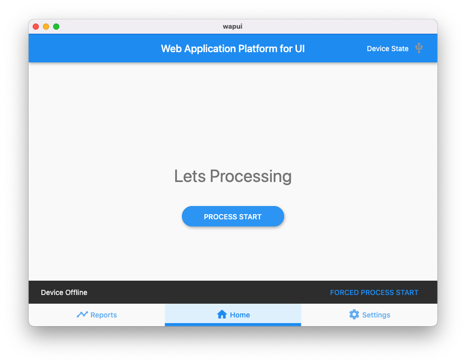
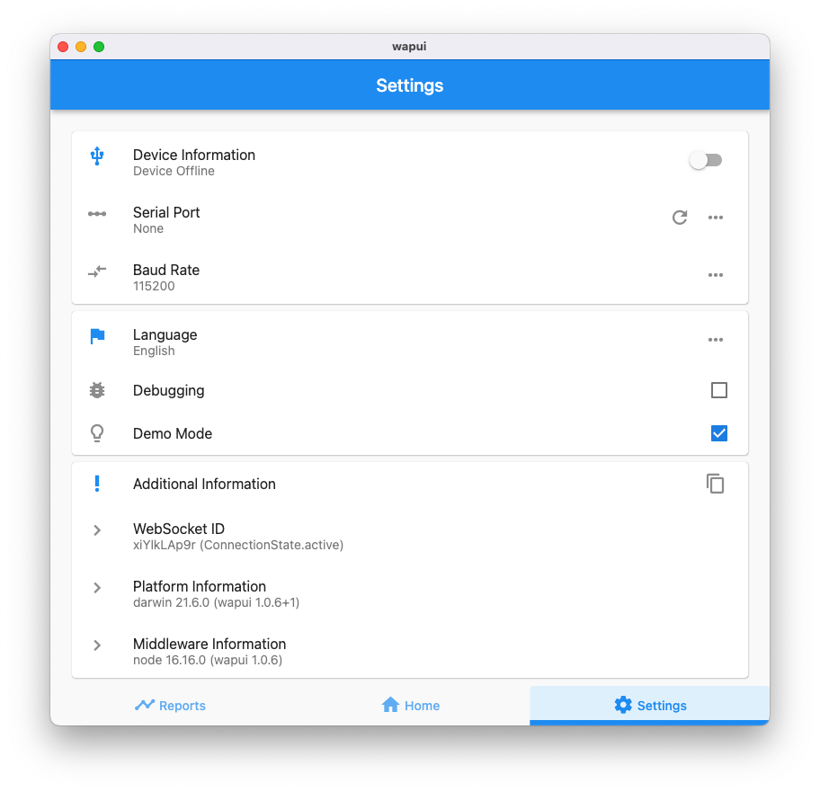

# simple-electron-nodejs-flutter-web

A simple Electron application using NodeJS middleware with Flutter web and Dart.




This project name is wapui (web application platform for ui).

- electron release application to MacOS, Linux and Windows (electron: version 21)
- npm managing scripts supported (npm: version 8)
- node.js middleware integrated (node: version 16)
- flutter web integrated (flutter: version 3)
- internalization supported (flutter: en, ko)
- loading spinning animation and status supported (electron: index.html)
- hiding electron menu supported (electron: index.html)
- debugging mode in settings (flutter web)
- copy basic information and status to clipboard (flutter web)
- logging to browser console log and transfer to nodejs middleware (flutter web)
- logging to specified log file (nodejs middleware)
- restful API supported (nodejs middleware)
- sqlite3 database integrated (nodejs middleware)
- and so on

This project shows you the below.

- how to interaction between flutter web and nodejs middleware
- how to payload relays between websocket in flutter web and serial port in nodejs middleware
- how to payload publication/subscription between websocket module and serial module using localbus in nodejs middleware
- how to use static data and stream data in flutter web using flutter provider pattern
- how to expose restful api in middleware and to use api in flutter web
- how to read and show version in pubspec.yaml and package.json
- how to debugging and logging in middleware or flutter web
- how to use sqlite3 local database in middleware

## Architecture

Flutter Framework
```bash
- /lib                  # flutter web
- /lib/main.dart        # main of webapp
- /lib/home.dart        # home page
- /lib/process.dart     # process pages (scenario example)
- /lib/reports.dart     # reports page
- /lib/settings.dart    # settings page
- /lib/data.dart        # data to serial, config/websocket
- /lib/api.dart         # request api/response to cache
```

Electron Framework
```bash
- /web                 # electron framework
- /web/index.html      # html page to loading flutter web and loading animation
- /web/index.js        # electron main to loading nodejs middleware
```

Middleware (Electron Framework using NodeJS)
```bash
- /web/middleware               # integrate to nodejs
- /web/middleware/index.js      # (middleware module: http/websocket listen to 8090)
- /web/middleware/knexfile.js   # sqlite3 local database info
```

```bash
- /web/middleware/db              # DB migration/seeding
- /web/middleware/db/data.sqlite3 # DB file
- /web/middleware/db/index.js     # (DB module)
- /web/middleware/db/migrations   # create to initial tables
- /web/middleware/db/seeds        # insert to initial values
```

```bash
- /web/middleware/server          # api/ws server
- /web/middleware/server/index.js # (server module)
```

```bash
- /web/middleware/server/api           # restful api expose and localbus service
- /web/middleware/server/api/index.js  # (api/ws module)
- /web/middleware/server/api/serial.js # api to serial port list/manage to port
- /web/middleware/server/api/config.js # api to key/value configs
- /web/middleware/server/api/ws.js     # api to websocket between flutter web and serial port
```

```bash
- /web/middleware/server/models            # query service
- /web/middleware/server/models/index.js   # (model module)
- /web/middleware/server/models/query.js   # model query to table
- /web/middleware/server/models/configs.js # query to configs table
```

## Release

To build for production, first run `npm run release`.

To check dist/ output directory.

```bash
# Clone this repository
% git clone https://github.com/ilshookim/simple-electron-nodejs-flutter-web.git
# Go into the repository
% cd simple-electron-nodejs-flutter-web
# Install dependencies
% npm install
# Build release to dist/
% npm run release
```

## Logging

By default, it writes logs to the following locations:

- on Linux: ~/.config/wapui/logs/main.log
- on macOS: ~/Library/Logs/wapui/main.log
- on Windows: %USERPROFILE%\AppData\Roaming\wapui\logs\main.log

## API

- [Config API](./doc/usage/config.md)
- [Serial API](./doc/usage/serial.md)

```bash
# Check to middleware
% curl http://localhost:8090/hello
Welcome!
```

## Customize

### Flutter Web (CanvasKit)

By default, flutter web renderer is html.
If you want CanvasKit, You just disable this line.

```js
window.flutterWebRenderer = "html";  // in web/index.html
```

### Electron App (Application Menu)

By default, electron default menu was removed.
If you want show the menu, You just disable this line.

```js
Menu.setApplicationMenu(null);  // in web/index.js
```

### Electron App (Window Size)

By default, electron app size is fixed 800 x 600.
If you want change the size to ratio 75% in primiary screen resolution, You just recalc = true; this line.

```js
const recalc = false, ratio = 0.75; // in web/index.js
```

### Middleware (Default Language)

By default, language is en.
If you want change to perfered language such as 'ko' is korean.

```js
 // in web/middleware/db/seeds/001_config_seed.js
{
  key: 'locale',
  value: 'en' // 'ko' --> korean
},
```

# Guide to Debugging

## To run the electron app

Basically middleware running automatically when to run the electron app.

```bash
# Clone this repository
% git clone https://github.com/ilshookim/simple-electron-nodejs-flutter-web.git
# Go into the repository
% cd simple-electron-nodejs-flutter-web
# Install dependencies
% npm install
# Install flutter dependencies
% npm run app:build
# Run the app
% npm run app
```

Also you can check to middleware on the electron app.

```bash
# Check to middleware
% curl http://localhost:8090/hello
```

## To use middleware and your browser (Edge, Chrome or Safari)

Open the app in browser: http://localhost:8090

```bash
# Clone this repository
% git clone https://github.com/ilshookim/simple-electron-nodejs-flutter-web.git
# Go into the repository
% cd simple-electron-nodejs-flutter-web
# Install dependencies
% npm install
# Install flutter dependencies
% npm run build
# Run the server
% npm run middlware
```

## To launch VSCode for coding and debugging

To luanch the VSCode.

To start debugging (F5 key) flutter web in lib/main.dart.

- should better to editing source files for middleware in web/ sucn as index.js, index.html.

```bash
# Clone this repository
% git clone https://github.com/ilshookim/simple-electron-nodejs-flutter-web.git
# Go into the repository
% cd simple-electron-nodejs-flutter-web
# Install dependencies
% npm install
# Install flutter dependencies
% npm run release
# Launching the vscode
% code .
```

- should better to open JavaScript Debug Terminal in vscode: ctrl+`, and check to + button in right side menu of vscode terminal.

```bash
# Run the middleware in debugging mode
% npm run mw
```

## Development Information

Basically required to flutter, npm and node to build and release, also need to code, git to edit and debugging.

### The development environments on MacOS:

Check to versions

```bash
# Flutter/Dart
% flutter --version
Flutter 3.3.4 • channel stable • https://github.com/flutter/flutter.git
Framework • revision eb6d86ee27 (3 days ago) • 2022-10-04 22:31:45 -0700
Engine • revision c08d7d5efc
Tools • Dart 2.18.2 • DevTools 2.15.0

# Npm/NodeJS
% npm --version
8.5.0

% node --version
v16.9.1

# VisualStudioCode
% code --version
1.72.0
64bbfbf67ada9953918d72e1df2f4d8e537d340e
x64

# Git
git --version
git version 2.37.0 (Apple Git-136)
```

### The development environments on CentOS7:

Installation Guide

```shell
# install snap
$ sudo yum update
$ sudo yum install -y epel-release
$ sudo yum install -y snapd
$ sudo systemctl enable --now snapd.socket
$ sudo ln -s /var/lib/snapd/snap /snap

# install flutter
$ sudo snap install flutter --classic
# if 'flutter command not found' you should ssh reconnection with a new session

# upgrade git version 1 to version 2
$ sudo yum install -y http://opensource.wandisco.com/centos/7/git/x86_64/wandisco-git-release-7-1.noarch.rpm
$ sudo yum remove -y git
$ sudo yum install -y git

# CXXABI_1.3.8' not found: https://github.com/TryGhost/node-sqlite3/issues/1610
$ wget http://mirror.ghettoforge.org/distributions/gf/el/7/gf/x86_64/gcc10-libstdc++-10.2.1-7.gf.el7.x86_64.rpm
$ sudo rpm -Uvh gcc10-libstdc++-10.2.1-7.gf.el7.x86_64.rpm
$ echo 'export LD_LIBRARY_PATH=$PATH:/opt/gcc-10.2.1/usr/lib64' >> ~/.bashrc
$ source ~/.bashrc

# firewall 8090 (if necessary)
$ sudo firewall-cmd --zone=public --add-port=8090/tcp --permanent
$ firewall-cmd --reload
```

Check to versions

```shell
$ cat /etc/redhat-release 
CentOS Linux release 7.9.2009 (Core)

$ flutter --version
Flutter 3.3.4 • channel stable • https://github.com/flutter/flutter.git
Framework • revision eb6d86ee27 (10 days ago) • 2022-10-04 22:31:45 -0700
Engine • revision c08d7d5efc
Tools • Dart 2.18.2 • DevTools 2.15.0

$ npm --version
8.12.1

$ node --version
v16.15.0

$ git --version
git version 2.31.1

$ sudo snap --version
snap    2.55.3-1.el7
snapd   2.55.3-1.el7
series  16
centos  7
kernel  3.10.0-1160.66.1.el7.x86_64
```

### The development environments on Windows:

Installation Guide

In cmd

```bat
# install git
C:\> winget install git

# install vscode
C:\> winget install vscode

# install nodejs
C:\> winget install -e --id OpenJS.NodeJS
```

In Powershell (administrator mode)

```bat
# install choco
C:\> Set-ExecutionPolicy Bypass -Scope Process -Force; [System.Net.ServicePointManager]::SecurityProtocol = [System.Net.ServicePointManager]::SecurityProtocol -bor 3072; iex ((New-Object System.Net.WebClient).DownloadString('https://community.chocolatey.org/install.ps1'))

# install flutter
choco install flutter --pre 
git config --global --add safe.directory C:/tools/flutter
```

Check to versions

```bat
C:\>ver

Microsoft Windows [Version 10.0.22000.1098]

C:\>git --version
git version 2.38.1.windows.1

C:\>node -v
v18.11.0

C:\>npm -v
8.19.2

C:\>code -v
1.72.2
d045a5eda657f4d7b676dedbfa7aab8207f8a075
x64

C:\>flutter --version

Flutter 3.4.0-17.1.pre • channel beta • https://github.com/flutter/flutter.git
Framework • revision 9833838839 (5 weeks ago) • 2022-09-20 18:12:36 -0500
Engine • revision 9b2472da99
Tools • Dart 2.19.0 (build 2.19.0-146.1.beta) • DevTools 2.16.0

```
